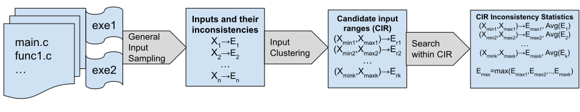

# CIGEN: Input Range Generation for Compiler-Induced Numerical Inconsistencies

## Overview

CIGEN is a tool that finds input ranges that cause high compiler-induced
numerical inconsistencies in numerical programs written in a compiled language.
Currently, CIGEN is tested with C/C++ language programs.

Numerical program behavior may diverge when they are compiled and run
differently. Many factors, such as different hardware architectures (for
example, the x87 FPU with its 80-bit registers), different compilers, or
different optimization flags (especially those that do not adhere to the
IEEE-754 2008 standard), may cause the results of floating-point computations to
become inconsistent. These inconsistencies are known as *compiler-induced
numerical inconsistencies*. Given a program with floating-point inputs and an
output, CIGEN generates inputs to test the program in an approach described
below and in our paper so that input ranges that cause high compiler-induced
numerical inconsistencies are found.

## How CIGEN Works



CIGEN is a Python-based tool that uses a 3 phase approach: first,
domain-partitioned sampling and coverage-based random sampling are performed to
generate sampling points in the input domain whose inconsistencies are then
calculated; second, input clustering is used to generate "candidate input
ranges" (CIR) where sample inputs that cause inconsistencies exist; lastly,
dense sampling and Differential Evolution are performed for each CIR to find the
statistics of inputs in the CIR, such as the average and maximum inconsistency
errors.

## Installation, Setup, and Running Example Programs

### Prerequisites

1. Linux system. We have tested on Ubuntu 22.04, both natively and on WSL2.
2. 10 GiB free disk space recommended.
3. Docker is installed on your system, and it is verified that you can call
   `docker pull` with non-root user without using `sudo`.
4. Clone this GitHub repository to a local directory of your choice.

```
git clone https://github.com/LLNL/CIGEN [CIGEN directory]
```

### Setup Docker container with code repository

We have two options to set up the reproduction environment.

#### Option 1: pull and run Docker container from DockerHub

In the Linux terminal, execute the following commands to pull the Docker
container and run it. After entering the root user bash prompt inside the Docker
container. The shell script will detect if you already have the container. If 
not, it will run it; otherwise, it simply resumes running.

```
cd [CIGEN directory]
./run_docker.sh
```

#### Option 2: build your own Docker container on local machine

Build the Docker image using the Dockerfile inside the code repository, then run
the Docker container. Please note that the RAM + swap area of your local PC must
be no less than 32GiB in order to finish building without errors. It takes
several hours to finish building the docker image.

```
cd [CIGEN directory]
docker build . -t ucdavisplse/cigen:latest
./run_docker.sh
```

### Setup environment (GSL download and install, LLVM Pass compilation)

Run the initial setup script (`setup.sh`) to install third-party software
required for CIGEN to run, build the LLVM TraceDiff pass (used by our implementation
of CIV), and compile different copies of the GSL binaries
with various optimization flags, which is required by the experiments.

```
cd /root/cigen
source setup.sh
```

### Run the GSL experiment (Section 4 in the paper)

The GSL experiment contains 175 GSL functions with floating-point input and
output, most of which are special functions such as Bessel and hypergeometric
functions. Amongst these functions, 122 are single-parameter functions, while
the rest 53 are multi-parameter. 

(The estimated runtimes below are all from our reference system with Intel i9-10980XE CPU.)

Run the following command to call CIGEN to find input ranges that cause
compiler-induced numerical inconsistencies for the 175 functions. During
experiment execution, you can track your progress with the heartbeat output.
**Estimated runtime of all 175 functions is 1 hour.**

```
cd /root/cigen/gsl_test
python3 run_gsl.py -name=de -plot
```

As a comparison, we also include our implementation of CIV referenced throughout
the paper. Run the following command to call CIV to find input that causes
high compiler-induced numerical inconsistencies for the 175 functions. During
experiment execution, you can track your progress with the heartbeat output.
**Estimated runtime of all 175 functions is 24 hours.**

```
cd /root/cigen/gsl_test
python3 run_gsl.py -name=civ
```

Also as a comparison, we include our implementation of BGRT referenced throughout
the paper. Run the following command to call BGRT to find input that causes
high compiler-induced numerical inconsistencies for the 175 functions. During
experiment execution, you can track your progress with the heartbeat output.
**Estimated runtime of all 175 functions is 6 hours.**

```
cd /root/cigen/gsl_test
python3 run_gsl.py -name=bgrt
```

The results can be found in `[CIGEN directory]/results/*.csv` files. The candidate
input ranges (CIR) and all the sample points generated in CIGEN can be found in the
`[CIGEN directory]/results/_de/` directory.

## License

CIGEN is distributed under the terms of the MIT License.

See LICENSE and NOTICE for details.

LLNL-CODE-864365
